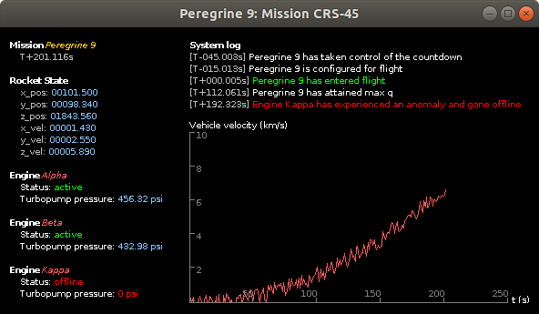
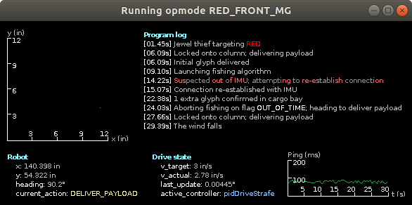

# Onyx

Onyx is a small Java library for creating live telemetry dashboards. Whether tracking rocket avionics or server activity, Onyx's minimalist design allows for high information density at a fraction of the complexity of larger libraries.





## Features

- [x] Modular dashboard assembly
- [x] Dynamically formattable text
- [x] Plaintext, scatter plot, and 2D graph readouts
- [x] Theme support
- [ ] HTML-esque dividers and containers
- [ ] Scrolling graph readouts

## Quickstart

### Dashboard Setup

Every dashboard begins with a `Display` object.

```java
// Width, height, font size, font name, color theme
Display disp = new Display(640, 480, 10, "default", Theme.DARK);
```

`Telemetry` modules are configured and added to the `Display`'s collection of active telemetry modules.

```java
FontMetrics fm = disp.fontMetrics();
// x position, y position, support formatting, font metrics
ParagraphTelemetry par = new ParagraphTelemetry(10, 10, true, fm,
        "!rMessage from Onyx", // Title text
        "#ihello, world"); // A line indented under title

disp.addTelemetry("message", par); // Identifying name, module
```

Here, the "!r" and "#i" are metacharacters indicating red and italic text, respectively.

To update a telemetry module, the instance can be retrieved from the `Display` by name.

```java
ParagraphTelemetry par1 = disp.getTelemetry("message");
par1.setLine(0, "#ibonjour, monde"); // Line index, new text
```

Dashboard creation is triggered with `launch` and refreshes are prompted with `update`.

```java
disp.launch("Dashboard"); // Window title

while (true)
  disp.update();
```

To smooth the interaction between the update and rendering threads, every call to `update` will briefly sleep the latter thread. The duration of these sleeps can be changed with `setRefreshRate`:

```java
disp.setRefreshRate(30); // Refresh rate in Hz (defaults to 60)
```

### Telemetry Modules

Various flavors of `Telemetry` represent data in different ways.

#### `ParagraphTelemetry`

A title followed by indented lines of text.

```java
ParagraphTelemetry systemClock = new ParagraphTelemetry(0, 0, true, disp.fontMetrics(),
    "#bSystem time", // Title text
    "" + (int) (System.currentTimeMillis() / 60000) + " minutes" // A line of telemetry
    "" + (int) ((System.currentTimeMillis() / 1000) % 60) + " seconds"); // Another line
```

#### `ValueMapTelemetry`

A format similar to `ParagraphTelemetry`, but lines below the header are unindented label-value pairs. Numeric values can be further formatted by specifying a `DecimalFormat`.

```java
ValueMapTelemetry cannonData = new ValueMapTelemetry(0, 0, true, disp.fontMetrics(),
    "Cannon"); // Map title
cannonData.addDecimalFormat("!bFlywheel speed (rpm)!w",
    new DecimalFormat("0000.0000")); // Label, format
cannonData.put("!bFlywheel speed (rpm)!w", 3012); // Label, value
cannonData.put("!bParticles in chamber!w", 3);
```

Here, the decimal format for the flywheel speed label is specified before assigning it a value because format updates are acknowledged in `put`.

#### `ConsoleTelemetry`

A chronological readout of timestamped text entries, not unlike a server log.

```java
ConsoleTelemetry console = new ConsoleTelemetry(0, 0, true, disp.fontMetrics(),
    "#b!yActions", 10); // Console title, maximum number of lines
console.log("!cUser!w enabled !{lr}autopilot", 112); // Line, point in time
```

`log` does not stamp entries by default. For that, a `Timestamper` must be specified:

```java
console.setTimestamper(
    // Decimal format, left brace, right brace
    new MissionTimestamper(new DecimalFormat("000.000"), "[!r", "!w]!l "));
```

#### `GraphTelemetry`

A 2D graph of data points.

```java
GraphTelemetry.Parameters p = new GraphTelemetry.Parameters();
p.x = 0;
p.y = 0;
p.coded = true;
p.width = 200;
p.height = 50;
p.theme = Theme.DARK;
p.fontMetrics = disp.fontMetrics();
p.font = disp.font();
p.xAxisLower = 0;
p.xAxisUpper = 500;
p.xAxisInterval = 50;
p.xFormat = new DecimalFormat("0");
p.xAxisLabel = "t (s)";
p.yAxisLower = 0;
p.yAxisUpper = 1000;
p.yAxisInterval = 250;
p.yFormat = new DecimalFormat("0");
p.yAxisLabel = "Mass flow rate (L/s)";

GraphTelemetry graph = new GraphTelemetry(p);
// Causes the graph to connect subsequent points rather than leaving them scattered
graph.setPlotMode(GraphTelemetry.PLOT_MODE_CONNECT);
graph.addPoint(10, 45, false); // x, y, wipe previous points
```      

### Text Formatting

Many telemetry modules support formatted text.

Color changes can be triggered with the '!' metacharacter followed by either a single-character color code or a multi-character color code clasped in curly brackets.

```java
par.setTitle("!oNozzle temperature"); // Orange
par.setLine(0, "!{lb}1800 K"); // Light blue
```

A complete list of color codes can be found in the `Display` class. New color codes can be defined with `Display.addColorCode`.

Font weight changes are indicated with '#', followed by either 'p', 'b', or 'i', for plain, bold, and italic, respectively.

```java
p.xAxisLabel = "#bt#p (#is#p)";
```

### Timestampers

Custom timestamp formats can be specified for `ConsoleTelemetry` modules, among other things. Native Onyx comes with two custom implementations of `Timestamper`: `FormatTimestamper`, which uses a simple `DecimalFormat`, and `MissionTimestamper`, which puts a decimal format into T+- countdown form. These implementations also allow for left and right bounding strings, and if used in formattable modules, synergize nicely with text formatting. For example:

```java
Timestamper ts = new FormatTimestamper(
    new DecimalFormat("00.00"), // Decimal format
    "[#b!g", // String preceding the time value
    "#p!w]"); // String succeeding the time value
```

The above format creates timestamps bound in plain white brackets, where the time value in between them is bold and green.
